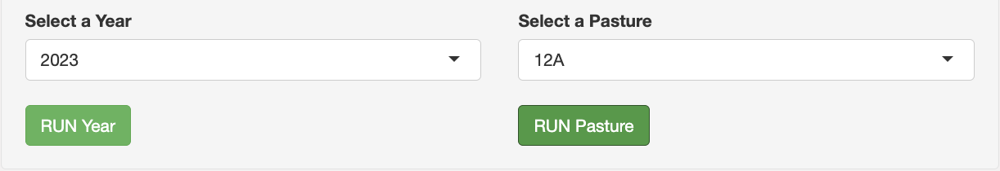
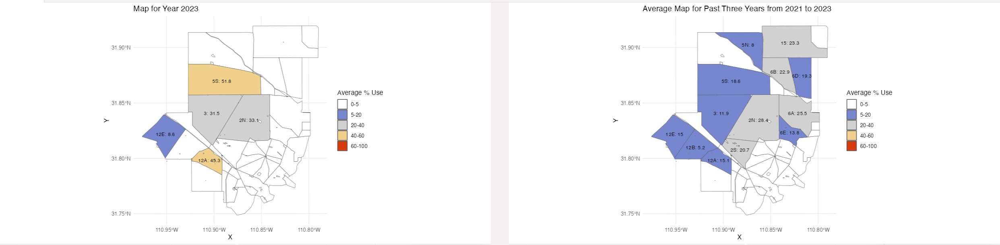
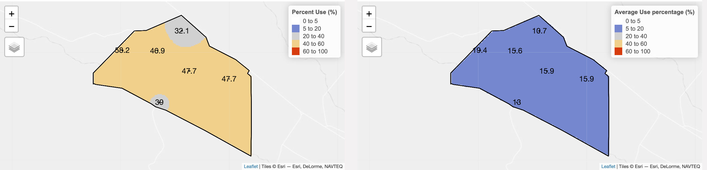

# SRER_Visual_Project

# Visualizing Utilization on the SRER

**Author:** Xiuchen Lu  
**Date:** May 2024

## Project Objective

The goal of this project is to create a data visualization tool to examine and observe the history of utilization occurring within a pasture over the pasture's history. Utilization is the amount of plant material that has been removed by animals during the grazing period. This includes the plant material consumed or lost through trampling. Examining utilization is important to understand the impact of grazing on the forage base. Effects of grazing on a single year may not affect the long term sustainability of a forage base, so multiple years need to be examined to inform the need for a change to grazing management. Holechek (1998) recommends adjustments to grazing management following two consecutive years of utilization exceeding 30% of the pasture or allotment. This recommendation is valuable in starting a conversation but ignores the larger risk associated with sustained high levels of use (overgrazing) over a longer time frame. To identify areas of sustained overgrazing between and within pastures, we propose the creation of a tool.

## Input Variables

In this program, we have two input boxes: one to enter the year we want to select and one for the specific pasture we want to select. The range of input years we currently support is between 2010 to 2023. The supported pastures include 12A, 12B, 12C, 12D, 12E, 15, 2N, 2S, 3, 5M, 5N, 5S, 6A, 6B, 6D, 6E.

## Average Pasture Use

The program is designed to analyze and visualize pasture utilization patterns over time. At its core, it allows the user to examine changes in ranch utilization based on a selected time window. The time windows range from one year to a maximum of ten years or more. By selecting a specific window, the user can use scroll bars to filter historical data on pasture utilization over time.

The visualization dynamically adjusts based on the "Select Year" variable to show how pasture utilization has changed over the years. Currently I have set the year to be the most recent year in the dataset (2023). The graph on the left shows pasture utilization in 2023, while the graph on the right shows the average of pasture utilization over the three-year period from 2021 to 2023. The color scale indicates the intensity of use, with different shades representing different levels of use, ranging from low (0-5%) to high (60-100%).

Assuming that use is consistent across the range, the average use metrics can help us understand the typical level of activity in a given area. However, in order to better understand the risk of overgrazing, which is a key factor in rangeland management, the program could provide a more granular analysis of individual sites within the rangeland. In this way, it would be possible to identify which specific sites may be at higher risk of overgrazing and require more targeted management interventions.

## Within Pasture Site Utilization

Within a user-defined time window, the program highlights highly utilized rangelands and provides detailed interpolated utilization maps for these areas. This enhanced data resolution allows the user to pinpoint specific locations in the pasture where overutilization may be present.

As shown, different areas of the pasture are color-coded to represent different levels of use from low to high. Users can adjust the time window after selecting a pasture to examine these areas in a more targeted manner. The map shows the percentage use values for specific locations within pasture 12A, allowing the user to identify areas that may need attention due to higher usage.

## Required Packages in R

In order for the entire project to work, you need to load the following R packages

install.packages(c("tmap", "sf", "ggplot2", "rgdal", "sp", "viridis", "readxl", "tidyverse", "lubridate", "readr", "googlesheets4", "data.table", "shiny", "colorspace", "dplyr", "terra", "RColorBrewer", "leaflet", "raster", "gstat", "grid", "gridExtra", "shinydashboard", "shinyjs", "shinyWidgets", "shinycssloaders", "waiter"))

## Running the Application 

1. Open the R project in Rstudio

2. Run the function.R first
   
   Please select lines 1 through 30 to run, and make sure the data set loads properly
   
   Next, please select all of the code to run and make sure that all the variables in the Environment are loaded properly
   
3. Please load the code in server.r and press Run App in the upper right corner to use it

### Additional Description

In this section, the interactive visualization tool reflects the use of Ranch 12A over a selected time period. When years prior to 2012 were selected, the tool was unable to display a three-year average map, indicating that available data or program features limited the analysis to years after 2012. As a result of this limitation, the time window for examining average usage must be set within the range of available data. As a result, users wishing to understand usage patterns prior to 2012 will need to rely on annual data rather than multi-year average metrics.

